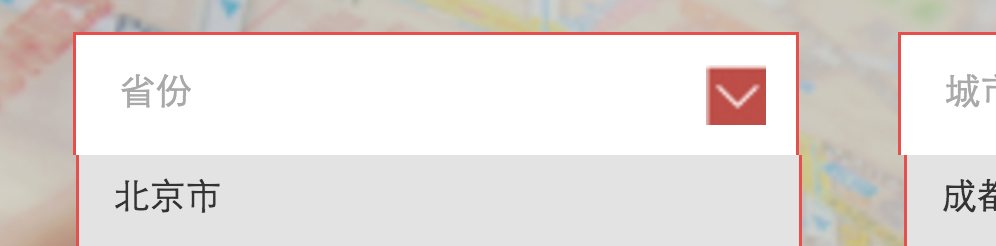
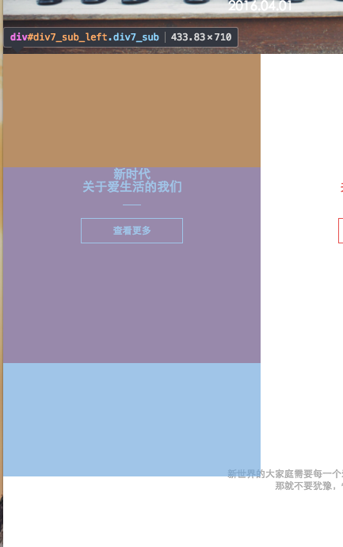

# 改进建议

## task7

非常不错哈, 布局是没有多大的问题的了, 接下来, 需要你重视的是排版.

### 加`border`导致盒子变大

加了active之后, 你的元素把banner给往下挤了5px:


那么你可以给普通的`li`加上一个透明的`border`, 然后在`.active`上只是改变`border`的颜色

```css
header li {
    border: 5px solid transparent;
}

header .active {
    border-color: #e74f4d;
}
```

### 登录按钮对不齐


你看, 你的这个是不是没有对齐呢? 垂直方向对齐是最重要的入门必修课.

1. 这其实是一个可以点击的链接.
2. 这种图片只是样式, 不应该作为网站内容的一部分. 应该使用背景图. 以便要更换样式时, 不用去更改html, 只需要另外编写css即可.
3. 除非有元素上下重叠的情况, 否则, **避免使用定位的方式**

你可以这么来做:

```html
<div class="header_right" href="#">
    <a class="enroll" href="#">登录</a>
</div>
```

```css
header .enroll{
    display: inline-block;
    margin-top: 18px;
    padding-left: 20px;
    height: 21px;
    line-height: 21px;
    font-size: 14px;
    color : #e74f4d;
    text-decoration: none;
    background: url(../img/header_pic2.png) no-repeat left center;
}
```

### 开始体验大小和垂直居中的问题


1. 这个还是应该是个a标签做成按钮的样式, 点击后直接跳链接
2. 使用padding, border会撑大盒子. 要记住: **一个元素的大小是由border, padding以及内容相加得来的**
3. 块级元素的行内子元素(除了文本框这类), 垂直居中的方式: 让这个块级元素line-height = height

```html
    <a class="div1_red" href="#">开始体验</a>
```

```css
main div .div1_red{
    display: block;
    margin: 70px 0px 0px 10px;
    width: 330px;
    height: 65px;
    line-height: 65px;
    font-size: 30px;
    font-family: 微软雅黑;
    text-align: center;
    text-decoration: none;
    color: #ffffff;
    background-color: #e74f4d;
}
```

### 下拉框有一个像素的错位



你看, 你这个是不是下拉的内容向右偏移了`1px`?

为什么会出现这种情况呢, 因为这个实现思路不对.
你每个都相对form去定位, 那你每个要单独去量, 如果需要稍微调整(比如去掉一个下拉框), 那么你又要全盘重新去量.

一个下拉框, 应该是一个整体, 又相对外部而言是一个独立的组件. 所以你每个下拉框, 包含一个`div`和`ul`, 应该用一个大的`div.select`去包裹他们
然后`ul`相对这个`.select`定位, 然后`.select`就不用定位了, 直接相当于并排的三个行内块级元素去处理就是了

### 子元素伸出父元素的区域



这个地方你给`main_div7`设置了`overflow:hidden`, 这是一个方法, 也还是很不错, 但实际上可以更简单.

在**使用了`height:100%`**的这种情况下, 为了避免伸出去, 可以把`.div7_sub`的`padding,margin`这些属性放在他的子元素上面(第一个`p元素`).
